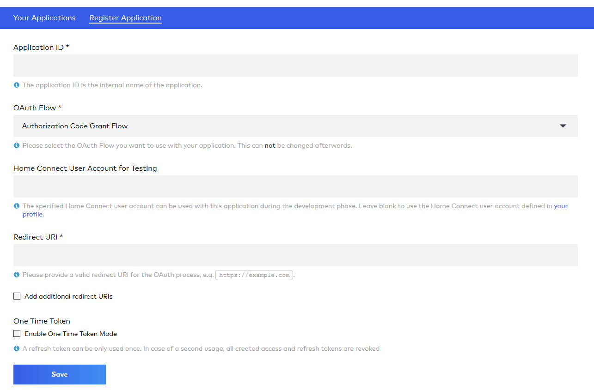
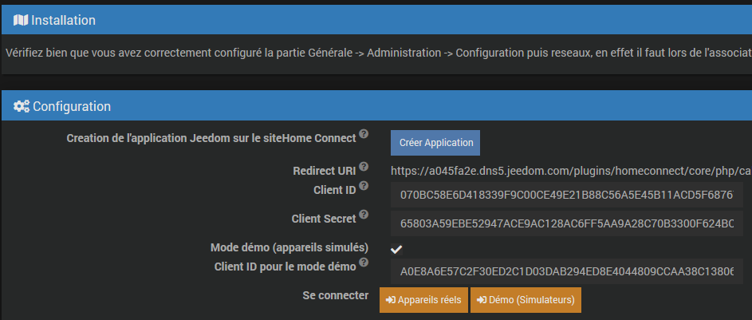

Présentation
===
Ce plugin permet de récupérer des informations des appareils utilisant le protocole Home Connect .
Il a été développé à l'origine par Sartog.

Installation/Configuration
===

Association de vos appareils avec Home Connect
---

Installez l'app Home Connect sur votre Smartphone depuis l'App Store Apple (IOS) ou depuis Google play (Android).

Créez un compte en indiquant votre adresse mail, cliquez sur le lien de validation dans le mail reçu puis retournez sur l'app et connectez vous à votre compte Home Connect.

Connectez les appareils à votre réseau local soit à l'aide de l'app ou en utilisant le WPS de votre box/routeur.

Associez les appareils à l'app en suivant le guide joint aux appareils.

Obtension d'un Home Connect application Client ID
---
Prérequis : Il faut absolument que l'accès externe de votre Jeedom soit bien configuré. Allez dans  Administration -> Configuration puis Réseaux et vérifez que c'est bien le cas. 
Si votre Jeedom n'est pas accessible de l'extérieur  l'association de Jeedom au compte Home Connect ne marchera pas et le plugin ne pourra pas fonctionner.

Vérifiez aussi que que dans Configuration -> API il y a bien une **Clé API Home Connect** et que l'accès API de cette clé est sur Activé.

Lors des tests, il semble que le serveur d'authentification Home Connect demande que l'adresse externe de Jeedom soit en https, le moyen le plus simple est d'utiliser les DNS de Jeedom.

Adhérez au programme des développeurs Home Connect en créant un compte sur le site https://developer.home-connect.com/user/register, il est important que l'adresse mail soit la même que celle utilisée lors de l'étape précédente dans l'app Home Connect pour smartphone.

Enregistrez une nouvelle application sur la page https://developer.home-connect.com/applications/add

- Application ID : par exemple Jeedom
- OAuth Flow : Authorization Code Grant Flow
- Home Connect User Account for Testing : l'adresse mail utilisée à l'étape précédente dans l'app Home Connect pour Smartphone
- Redirect URI : l'url de retour disponible sur la page de configuration du plugin de la forme https://xxxxxxxxxxx.jeedom.com/plugins/homeconnect/core/php/callback.php?apikey=yyyyyyyyyyyyy
- Surtout ne cochez pas la case Enable One Time Token Mode

Si plus tard vous désirez revoir les détails de votre application ou les modifier, allez sur la page https://developer.home-connect.com/applications

Enregistrez le Client ID et le Client secret Obtenus et reportez les dans le champs correspondants de la page configuration du plugin. Sauvegardez.

Cliquez sur le bouton **Se connecter** indiquez l'adresse mail et le mot de passe de votre compte Home Connect (celui donné dans l'app sur le smartphone pas celui du site développeur) et confirmer que vous autorisez l'accès.

Découverte de vos appareils Home Connect
---

Rendez vous sur la page équipement du plugin (Menu Plugins -> Objets connectés _> Home Connect) et cliquez sur le bouton Synchronisation.

Vos appareils apparaissent dans la section **Mes appareils** avec une image les représentant s'ils sont connus du plugin ou une icône générique dans le cas contraire.

Aidez-nous à améliorer le plugin: si l'image de votre appareil n’est pas disponible, signalez le sur le forum communautaire en indiquant le modèle tel qu'il apparaît dans la page de votre équipement.

FAQ
===

*J'aimerais remonter des erreurs/modifications au sujet de ce plugin ?*

C'est tout à fait possible via le forum communautaire Jeedom https://community.jeedom.com/ catégorie Plugins -> Objets connectés. Créez un nouveau sujet et n'oubliez pas de lui ajouter le tag "plugin-homeconect".
