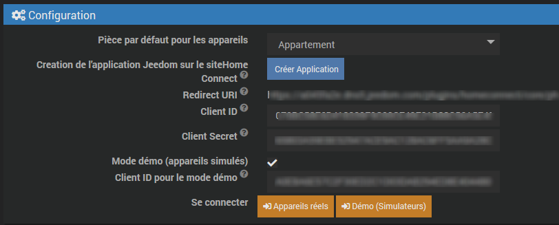

Présentation
===
Ce plugin permet de récupérer des informations des appareils utilisant le protocole Home Connect .
Il a été développé à l'origine par Sartog.

Un mode démo utilisant des appareils simulés est disponible vous permettant de tester le plugin même si vous ne possédez pas d'appareil ménager Home Connect. 
Six appareils sont disponible en mode démo: une machine à café, un réfrigérateur congélateur, un lave linge, un four, un lave vaiselle, un sèche linge.

Installation/Configuration
===

Association de vos appareils avec Home Connect
---

Installez l'app Home Connect sur votre Smartphone depuis l'App Store Apple (IOS) ou depuis Google play (Android).

Créez un compte en indiquant votre adresse mail, cliquez sur le lien de validation dans le mail reçu puis retournez sur l'app et connectez vous à votre compte Home Connect.

Connectez les appareils à votre réseau local soit à l'aide de l'app ou en utilisant le WPS de votre box/routeur.

Associez les appareils à l'app en suivant le guide joint aux appareils.

Précautions importantes à bien observer lors de la suite des opérations
---

**Prérequis** : Il faut absolument que l'accès externe de votre Jeedom soit bien configuré. Allez dans  Administration -> Configuration puis Réseaux et vérifiez que c'est bien le cas. 
Si votre Jeedom n'est pas accessible de l'extérieur  l'association de Jeedom au compte Home Connect ne marchera pas et le plugin ne pourra pas fonctionner.

**IMPORTANT** Il faut faire toute la procédure de connexion en étant connecté à votre Jeedom par l'adresse externe en http://.... si vous la faites en etant connecté par l'adresse interne en 192.168.x.y, vous aurez bien les dialogues du serveur Home Coonnect
vous demandant de vous identifier et le dialogue vous demandant de confirmer, mais au retour dans votre Jeedom vous obtiendrez un message d'erreur.

Vérifiez aussi que que dans Configuration -> API il y a bien une **Clé API Home Connect** et que l'accès API de cette clé est sur **Activé**.

Lors des tests, il semble que le serveur d'authentification Home Connect demande que l'adresse externe de Jeedom soit en https et pas http, le moyen le plus simple est d'utiliser les DNS de Jeedom.

Obtention d'un Home Connect application Client ID
---

Adhérez au programme des développeurs Home Connect en créant un compte sur le site https://developer.home-connect.com/user/register, il est important que l'adresse mail soit la même que celle utilisée lors de l'étape précédente dans l'app Home Connect pour smartphone.

Enregistrez une nouvelle application sur la page https://developer.home-connect.com/applications/add (cette étape n'est pas nécessaire si vous ne voulez utiliser que le mode démo.

- Application ID : par exemple Jeedom
- OAuth Flow : Authorization Code Grant Flow
- Home Connect User Account for Testing : l'adresse mail utilisée à l'étape précédente dans l'app Home Connect pour Smartphone
- Redirect URI : l’url de retour disponible sur la page de configuration du plugin (elle est de la forme https://xxxxxxxxxxx.jeedom.com/plugins/homeconnect/core/php/callback.php?apikey=yyyyyyyyyyyyy 
si vous utilisez les DNS Jeedom ou https://zzzzzzz/plugins/homeconnect/core/php/callback.php?apikey=yyyyyyyyyyyyy si vous utilisez un autre moyen de sécuriser l’accès externe de votre Jeedom).
- Surtout ne cochez pas la case Enable One Time Token Mode

Si plus tard vous désirez revoir les détails de votre application ou les modifier, allez sur la page https://developer.home-connect.com/applications

Si vous désirez utiliser le mode démo avec des appareils simulés il vous suffit de noter le client ID inscrit dans le rectangle API Web Client et de le reporter dans le champ **Client ID pour le mode démo** de la page configuration du plugin et de cocher la case **Mode démo (appareils simulés)**. Sauvegardez.

Si vous voulez que le plugin fonctionne avec vos appareils réels, copiez le Client ID et le Client secret inscrits dans le rectangle Jeedom et reportez les dans le champs correspondants de la page configuration du plugin. Sauvegardez.

Suivant le mode choisi, cliquez sur le bouton **Appareils réels** et indiquez l'adresse mail et le mot de passe de votre compte Home Connect (celui donné dans l'app sur le smartphone pas celui du site développeur) et confirmer que vous autorisez l'accès.

Pour le mode démo cliquez sur le bouton **Démo (Simulateurs)** vous n'aurez rien à indiquer.

Découverte de vos appareils Home Connect
---

**IMPORTANT** : Avant une synchronisation, vérifiez que vos appareils sont bien allumés, connectés au WiFi et qu'aucun programme n'est en cours.

Rendez vous sur la page équipement du plugin (Menu Plugins -> Objets connectés -> Home Connect) et cliquez sur le bouton Synchronisation.

Vos appareils apparaissent dans la section **Mes appareils** avec une image les représentant suivant leur type.

Commandes
===

Les commandes disponibles dépendent du type d'appareil et du modèle. De plus options et états et réglages peuvent varier suivant le programme choisi.

Utilisation des programmes
===
Pour les types d'appareils qui comportent des programmes : lave-linge, lave vaisselle, four, machine à café, il faut d'abord sélectionner le programme puis les options et cliquer sur le bouton lancer pour que le programme démarre.

FAQ
===

*J'aimerais remonter des erreurs/modifications au sujet de ce plugin ?*

C'est tout à fait possible via le forum communautaire Jeedom https://community.jeedom.com/ catégorie Plugins -> Objets connectés. Créez un nouveau sujet et n'oubliez pas de lui ajouter le tag "plugin-homeconect".

LIMITATIONS ET BUGS
===

- Historiquement il était impossible de contrôler certains types d'appareils comme les fours et plaques de cuisson. Cette limitation a été levée par Home Connect en Mai 2021 et le plugin a été modifié pour en profiter. Mais pour obtenir ces nouveaux droits, il faudra vous reconnecter.

- l'actualisation des états des appareils se fait par un cron dont l'intervalle est réglable dans la page de configuration du plugin. 
Ce n'est vraiment pas idéal. Dans le futur un démon recevant les événements envoyés par le serveur permettra de résoudre ce problème.

- Il y a une limite de 1000 requêtes par jour et par client sur le serveur Home Connect. Lorsque ce nombre est atteint, on est blacklisté pour 24h. Si vous avez plusieurs appareils cette limite est vite atteinte. Désactivez l'actualisation par le cron et actualisez manuellement.

- Il faudrait des widgets personnalisés pour certaines commandes. Si vous utilisez Jeedom V4 vous pouvez améliorer cela en utilisant l'outil Widget.

- Certains types d'appareils n'ont pas été vraiment testés faute de testeurs : Réfrigérateur, Congélateur, Cave à vin, réfrigérateur congélateur, Machine à café. Je pense d'ailleurs que pour certains types d'appareils aucun modèle n'est actuellement commercialisé en France.
